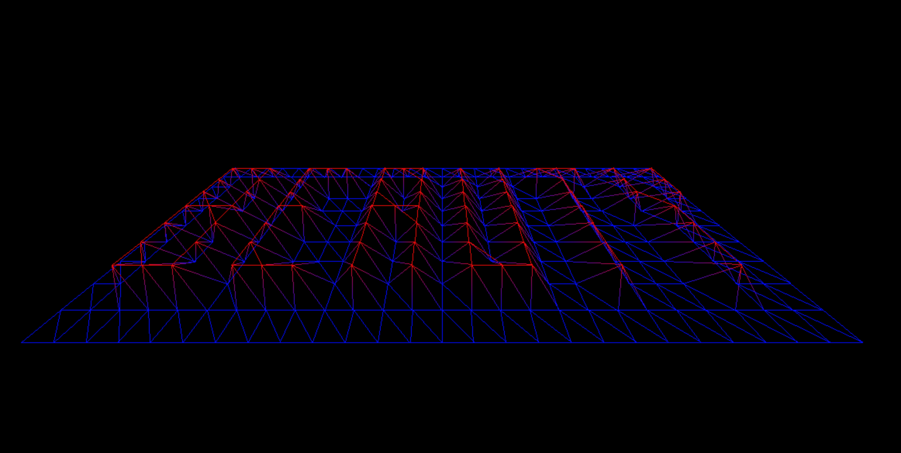
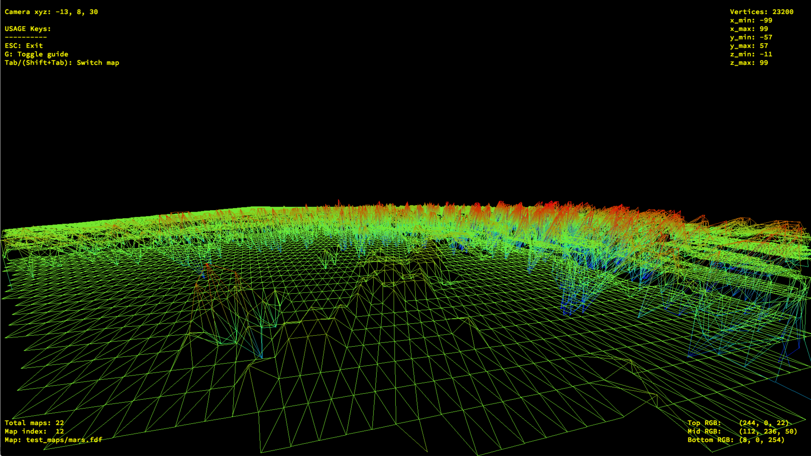

# FDF (Wireframe)
A wireframe modeling of 3D landscapes. Hive's (School 42) introduction assignment to computer graphics. (See assignment_brief.en.pdf).

Due to norm limitations (only `exit`, `open`, `close`, `write`, `read`, `malloc`, `free`, and the functions of `minilibx (libmlx)` and `math.h`), Libmatrix was written for this project. Libft was an earlier school assingment (standard c functions + own extras).



# Run
```
git clone git@github.com:hakolao/ft_wireframe.git && cd ft_wireframe
make
./fdf test_maps/*
```


# Features
- Input handling with guiding errors
	- Maps must not have empty rows
	- Lines must consist of spaces & (+/-)numbers
	- File must not be empty
	- Length of rows must be equal for each row
	- See example valid files in `test_maps`, invalid files in `test_maps_invalid`
- FPS camera with WASD & mouse movement
- Rotation of map
- Perspective options (Orthographic & Perspective)
- Map scaling
- Reset map to original state
- Colors with gradient based on vertex height (z)
- Change colors & background
- Bresenham line drawing



# Usage
```
ESC: Exit
G: Toggle guide
Tab/(Shift+Tab): Switch map
Left: Rotate map y-
Right: Rotate map y+
Up: Rotate map x+
Down: Rotate map x-
W: Move forward
S: Move backwards
A: Strafe left
D: Strafe right
Q: Rotate map z-
E: Rotate map z+
C: Loop map color
B: Loop bg color
P: Loop perspective
R: Reset
O: Show coords
1: zoom -
2: zoom +
Num 4: Turn left
Num 6: Turn right
Num 8: Turn up
Num 2: Turn down
Num +: Scale map up
Num -: Scale map down
Scroll up: Scale map z up
Scroll down: Scale map z down
Hold left mouse & move: Rotate camera
Hold right mouse & move: Rotate map
```

# Notes
- Code follow's 42's strict norms:
- Functions must not exceed 25 lines
- Max 5 functions in a .c file
- Cannot stick variable declaration and initialization on the same line
- Max 5 variables per block
- Max 4 parameters per function
- Forbidden keywords: `for`,  `do ... while`, `switch`, `case`, `goto`

